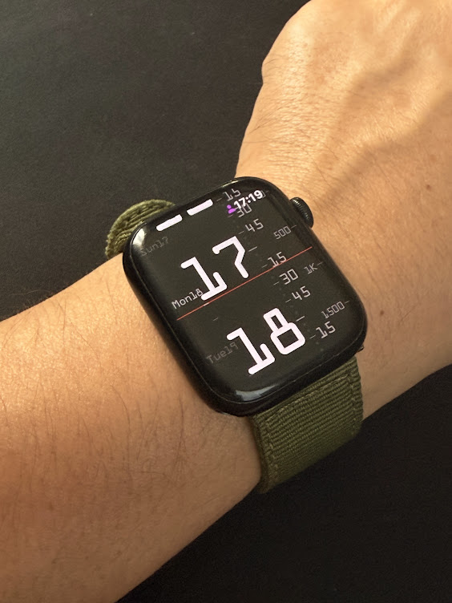
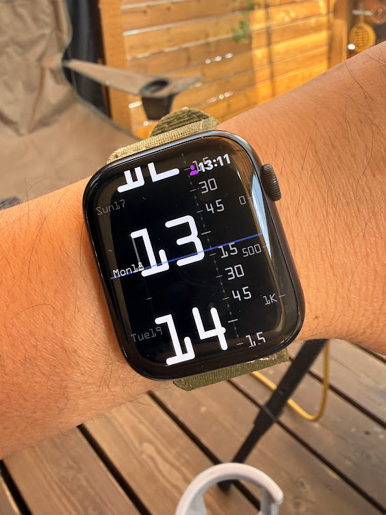
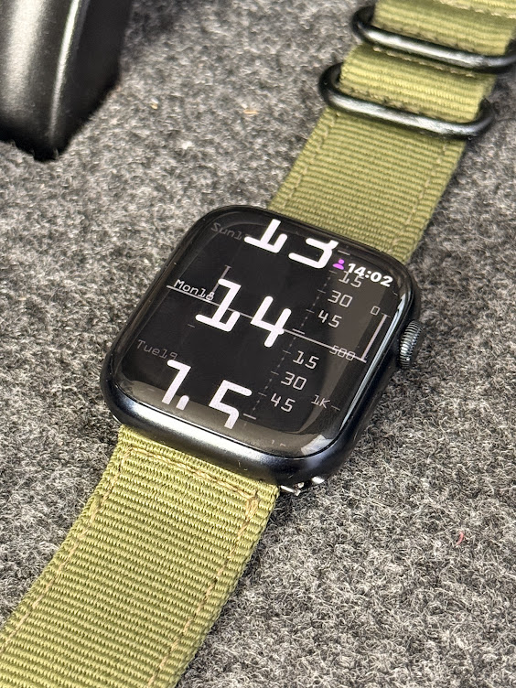

# Vertical Slider Watch Face

A standalone watchOS app that displays time as a vertical sliding timeline, inspired by analog ruler instruments. Built with SwiftUI and Canvas for Apple Watch Series 9+.

## Features

- **Vertical Timeline Ruler** - Time flows bottom-to-top with smooth scrolling, hour numbers, quarter marks, and 5-minute dots
- **Simple Mode** - Static HH:MM display as an alternative layout
- **Step Counter** - Daily step count from HealthKit displayed as a vertical slider
- **Date Panel** - Day/date with scrolling day progression
- **Always On Display** - Reduced luminance mode support
- **Persistent Foreground** - HKWorkoutSession keeps the app active indefinitely
- **Customization** - Accent color, background color, layout mode, and complication toggles via long-press menu

## Screenshots

  
  
  

## Requirements

- Apple Watch Series 9 or later
- watchOS 10.0+
- Xcode 15+
- [XcodeGen](https://github.com/yonaskolb/XcodeGen) (for project generation)

## Installation

1. Clone this repository
2. Install XcodeGen if needed: `brew install xcodegen`
3. Generate the Xcode project: `xcodegen generate`
4. Open `VerticalSlider.xcodeproj` in Xcode
5. Update the signing team to your own Apple Developer account
6. Build and run on your Apple Watch (Cmd+R)

> Note: Without an Apple Developer Program membership ($99/year), sideloaded apps expire after 7 days and need to be reinstalled.

## Customization Options

### Accent Colors
Blue, Green, Red, Yellow, Purple, White

### Background Colors
Black, Dark Gray, Khaki, Tan Desert, Olive, Navy

### Layout Modes
- **Timeline** - Full vertical scrolling ruler
- **Simple** - Static time display

## Credits

Design inspired by [**Sliders Vartical**](https://apps.garmin.cn/apps/2f3c810a-7f81-4716-b4a9-d39f4445ded2) watch face for Garmin by QuickApps ([dawnrunner](https://paypal.me/dawnrunner)), which is based on an original concept by fibonacci studios.

## License

MIT
